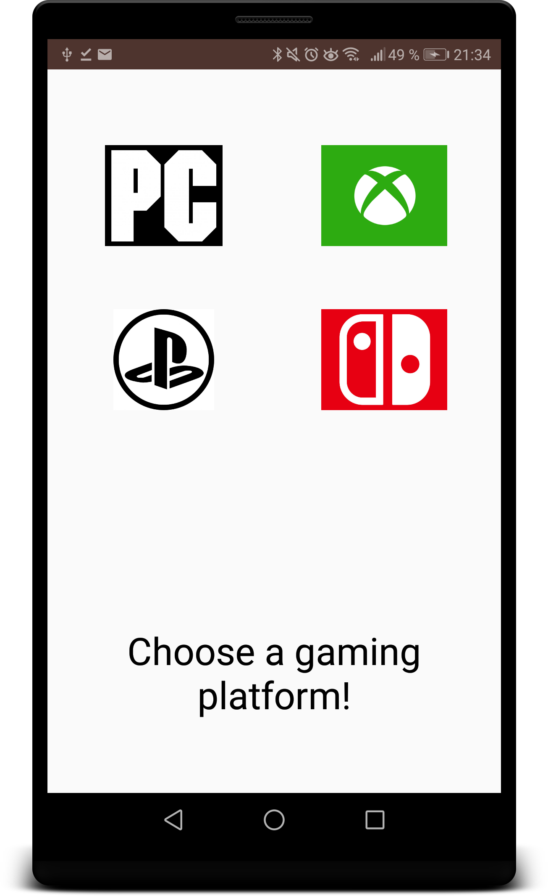
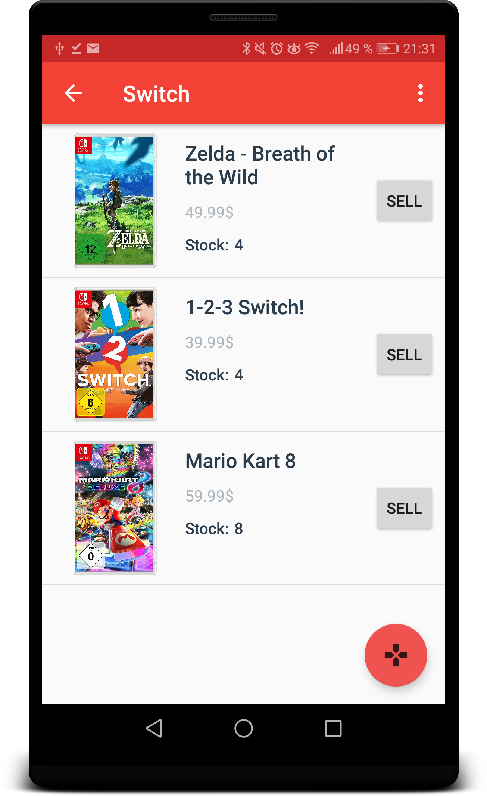
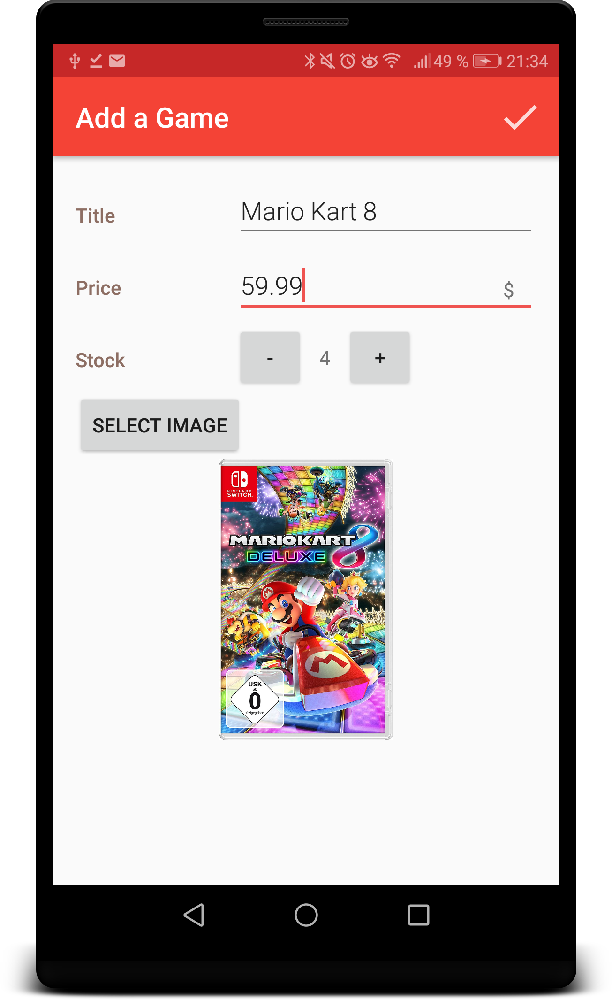

# GameStock

GameStock is an Android app that helps small videogame resell businesses to keep track
of their stock. The user can choose the plattform and then add new games by uploading
a cover art and adding additional information like title, price and stock. The information
gets stored in a SQLite database via a content provider.

The added games are then shown in a list where you can easily edit and keep track of the stock count.

To get started simply clone this repository and use the code with Android Studio.

